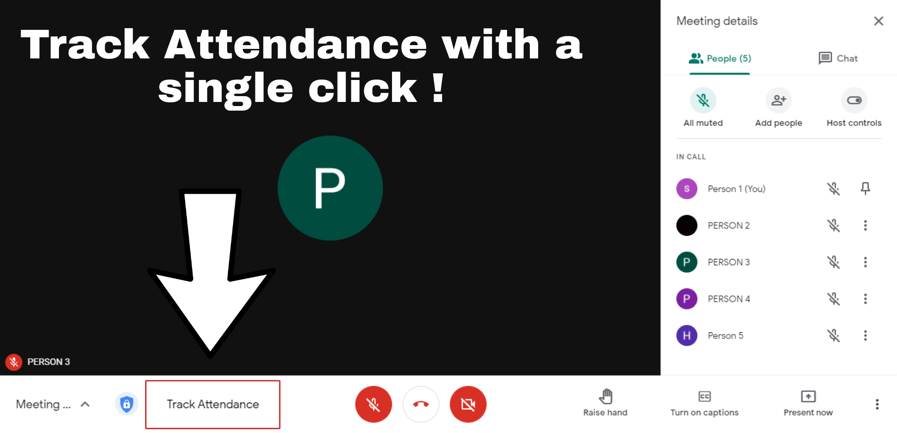
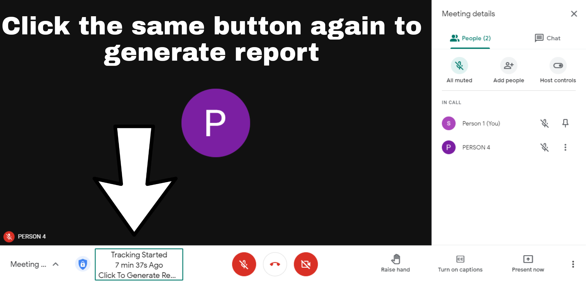
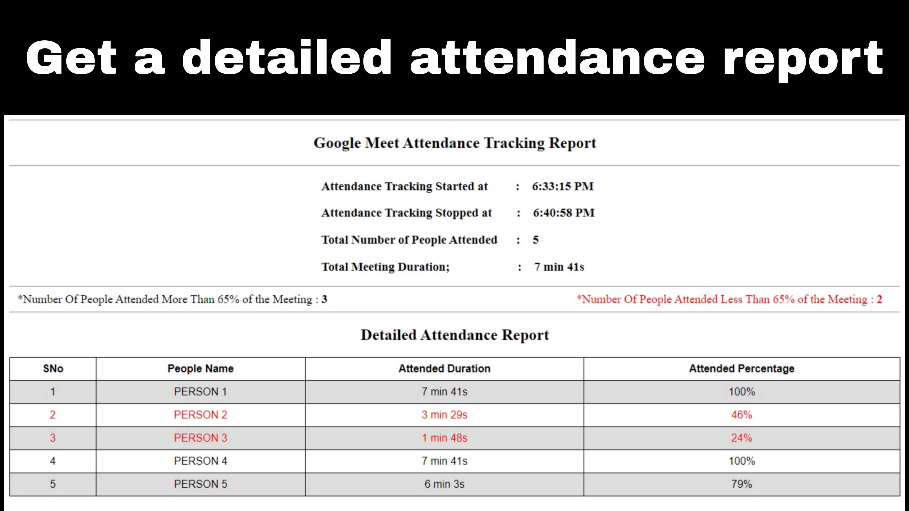

# google_meet_attendance_tracker

This extension in available in chrome web store folllow the link to install this extension in your chrome browser
link : https://chrome.google.com/webstore/detail/google-meet-attendance-tr/ldjjokmalaidehbgbifihdfdondjgfha

<h2>
  Images
</h2>
 
 A new button name track attendance will be added to google meet ui

  
 
 once the button is clicked the attendance tracking script starts and starts tracking attendance every second

  
 
 Once you need to generate report click the same button again, a new html page will be opened with the attendance details

  
